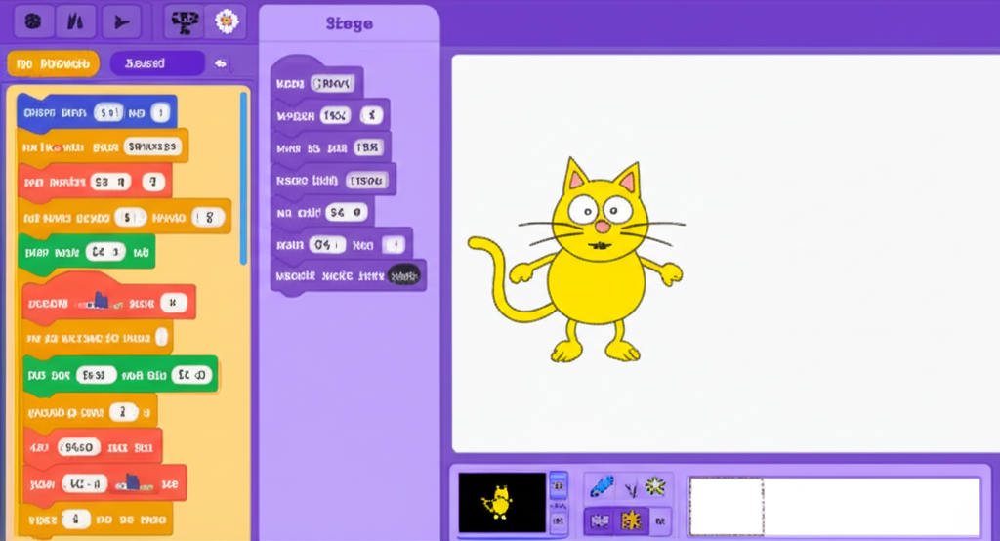

# Scratch Clone

A visual programming environment inspired by MIT Scratch, built with React and TypeScript.

## Features

- Drag-and-drop block-based programming
- Multiple sprite support
- Motion and looks animations
- **Hero Feature**: Sprites swap their blocks when they collide!
- Interactive demo mode
- Customizable blocks with user input values

## Prerequisites

- Node.js (v14 or newer)
- npm or yarn

## Installation

Follow these steps to run the project locally:

1. **Clone or download the project**

   If you've downloaded the ZIP file, extract it to a folder of your choice.

2. **Navigate to the project directory**

   \`\`\`bash
   cd scratch-clone
   \`\`\`

3. **Install dependencies**

   Using npm:
   \`\`\`bash
   npm install --legacy-peer-deps
   \`\`\`

   Or using yarn:
   \`\`\`bash
   yarn install
   \`\`\`

4. **Start the development server**

   Using npm:
   \`\`\`bash
   npm start
   \`\`\`

   Or using yarn:
   \`\`\`bash
   yarn start
   \`\`\`

5. **Open the application**

   Open your browser and navigate to [http://localhost:3000](http://localhost:3000)

## How to Use

### Basic Controls

- **Add Sprite**: Click the "Add Sprite" button to add a new sprite to the canvas
- **Play All Sprites**: Click the "Play" button to run all sprites' blocks simultaneously
- **Reset All**: Click the "Reset All" button to clear all sprites and blocks
- **Hero Feature Demo**: Click this button to see a demonstration of sprites swapping blocks when they collide

### Working with Blocks

1. **Add blocks to a sprite**:
   - Drag blocks from the left panel to a sprite's block area
   - Click on a block to edit its values

2. **Move sprites**:
   - Click and drag sprites on the canvas to position them
   - Sprites will move according to their blocks when you click "Play"

3. **Create collisions**:
   - Position sprites so they'll collide when moving
   - When sprites collide, they'll swap their blocks and continue with their new behavior!

## Project Structure

- `src/components/`: React components
- `src/types/`: TypeScript type definitions
- `src/utils/`: Utility functions

## Technologies Used

- React
- TypeScript
- Tailwind CSS
- React DnD (for drag and drop)

## License

MIT

## Acknowledgements

Inspired by MIT's Scratch project (https://scratch.mit.edu/)
